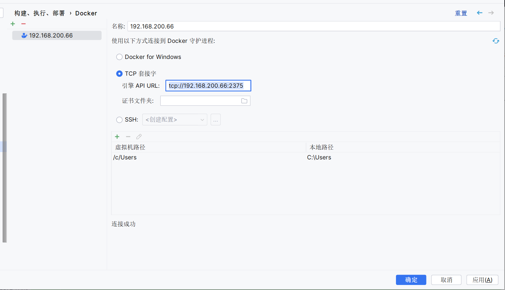

# 1. springboot创建镜像命令

~~~
    Spring Boot 预装了自己的用于构建 Docker 镜像的插件，我们无需进行任何更改，因为它就在 pom.xml 中的 spring-boot-starter-parent。
    
    你不需要写 Dockerfile，也不用操别的心，plugin 都帮你做了，例如 Spring 建议的安全、内存、性能等问题。
~~~

## 1.1 使用方法

mvn spring-boot:build-image

## 1.2 跳过测试

mvn spring-boot:build-image -DskipTests=true

# 2. jib-maven-plugin

~~~
    Jib 是一个 Maven 和 Gradle 插件，用来创建 Docker 镜像。
    这个插件有一个非常明显的特点：不需要本地安装 Docker。
    这对持续集成是非常方便的，Jib 可以直接推送到指定的 Docker 仓库。
~~~

## 2.1 依赖方式

### 2.1.1 添加依赖

~~~
<!-- https://mvnrepository.com/artifact/com.google.cloud.tools/jib-maven-plugin -->
<dependency>
    <groupId>com.google.cloud.tools</groupId>
    <artifactId>jib-maven-plugin</artifactId>
    <version>3.4.1</version>
</dependency>
~~~

### 2.1.2 命令

~~~
mvn compile com.google.cloud.tools:jib-maven-plugin:2.3.0:dockerBuild
~~~

### 2.1.3 说明

~~~
2.3.0为对应的插件版本
~~~

## 2.2 插件方式

### 2.2.1 添加插件

~~~
<plugin>
<!-- ======================================= Jib 是一个 Maven 和 Gradle 插件，用来创建 Docker 镜像======================================= -->
    <!-- https://mvnrepository.com/artifact/com.google.cloud.tools/jib-maven-plugin -->
    <groupId>com.google.cloud.tools</groupId>
    <artifactId>jib-maven-plugin</artifactId>
    <version>3.4.1</version>
</plugin>
~~~

### 2.2.2 使用方法

~~~
mvn compile jib:build -Dimage=openv1
~~~

# 3. dockerfile-maven-plugin

~~~
    这个插件就需要我们写 Dockerfile 了。
    Dockerfile 需要放在项目的根目录下，和 pom.xml 在一起。
~~~

# 4. idea重docker插件连接服务器方法

## 4.1 修改docker配置文件

### 4.1.1 在ExecStart后面加上下面的协议

~~~
    vim /usr/lib/systemd/system/docker.service
~~~

添加

~~~
    -H tcp://0.0.0.0:2375
~~~

### 4.1.2 重启docker

~~~
    systemctl daemon-reload
    systemctl restart docker
~~~

### 4.1.3 验证

~~~
dockers所在服务器的ip:2375/version ，显示这样就是成功：

{
    "Platform": {
        "Name": "Docker Engine - Community"
    },
    "Components": [
        {
            "Name": "Engine",
            "Version": "20.10.21",
            "Details": {
                "ApiVersion": "1.41",
                "Arch": "amd64",
                "BuildTime": "2022-10-25T18:02:38.000000000+00:00",
                "Experimental": "false",
                "GitCommit": "3056208",
                "GoVersion": "go1.18.7",
                "KernelVersion": "3.10.0-1160.el7.x86_64",
                "MinAPIVersion": "1.12",
                "Os": "linux"
            }
        },
        {
            "Name": "containerd",
            "Version": "1.6.10",
            "Details": {
                "GitCommit": "770bd0108c32f3fb5c73ae1264f7e503fe7b2661"
            }
        },
        {
            "Name": "runc",
            "Version": "1.1.4",
            "Details": {
                "GitCommit": "v1.1.4-0-g5fd4c4d"
            }
        },
        {
            "Name": "docker-init",
            "Version": "0.19.0",
            "Details": {
                "GitCommit": "de40ad0"
            }
        }
    ],
    "Version": "20.10.21",
    "ApiVersion": "1.41",
    "MinAPIVersion": "1.12",
    "GitCommit": "3056208",
    "GoVersion": "go1.18.7",
    "Os": "linux",
    "Arch": "amd64",
    "KernelVersion": "3.10.0-1160.el7.x86_64",
    "BuildTime": "2022-10-25T18:02:38.000000000+00:00"
}
~~~

## 4.2 远程连接

~~~
前提：有docker插件 可以在Setting-Plugins里下载
~~~

### 4.2.1 Setting-Docker选项 主要配置TCP

